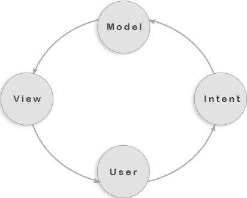
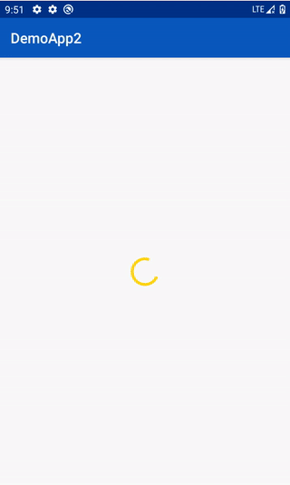

In this article, we will create a simple application to understand how to use the MVI Architecture and my Redux/MVI-like Android library. The app will load posts from [jsonplaceholder](https://jsonplaceholder.typicode.com/) and display them on the screen.

**Note:** _It relies on reactive and functional programming (RxJava)._

# What is MVI?

MVI is an architectural design pattern that stands for Model, View, Intent. It works on the concept of Unidirectional Data Flow. According to this concept, data has one, and the only way to be transferred to other parts of the application.

{: .center-image }

**Data Flow:**

- Model takes the intent to manipulate the state of the application.
- Intent is nothing else but the actions triggered by the user.
- View is a result of the state rendered and showed to the screen.

So, if you are familiar with web development and React, you have already probably noticed that MVI is no different from Redux. Otherwise, I recommend you to read about [Redux](https://redux.js.org) first.

Let's get started.

### 1. Initial setup

Firstly, let’s add dependencies to the project. For that, we need to add the Maven repository to the project root build.gradle.

```
allprojects {
    repositories {
        maven { url 'https://jitpack.io' }
    }
}
```

Now, add all dependencies that we will use in the app.

```
//RxMvi
implementation project(":rxmvi")

//Android
implementation projectDependencies["core_ktx"]
implementation projectDependencies["app_compat"]
implementation projectDependencies["constraint_layout"]
implementation projectDependencies["recycler_view"]

//ViewModel
implementation projectDependencies["viewmodel"]
implementation projectDependencies["activity_delegate"]
implementation projectDependencies["fragment_delegate"]

//Hilt
implementation projectDependencies["hilt"]
kapt projectDependencies["hilt_android_comp"]
implementation projectDependencies["hilt_lifecycle"]
kapt projectDependencies["hilt_comp"]

//Retrofit
implementation projectDependencies["retrofit"]
implementation projectDependencies["gson_converter"]
implementation projectDependencies["rxretrofit_adapter"]

//Testing
testImplementation projectDependencies["junit"]
androidTestImplementation projectDependencies["junit_ext"]
androidTestImplementation projectDependencies["espresso"]
```


### 2. Setup Hilt

We need to create a class that extends the Application class. 

```kotlin
@HiltAndroidApp
class App: Application()
```

The next step is to add the class to the Manifest file.

```
android:name=".App"
```

Under the di package, let’s create a Hilt module. In the module, we are going to provide a retrofit instance and an interface for communication with the free fake online REST API.

```kotlin
@Module
@InstallIn(ApplicationComponent::class)
class PostsModule {

    @Provides
    fun providesRetrofitInstance(): Retrofit {
        return Retrofit.Builder().baseUrl("https://jsonplaceholder.typicode.com/")
            .addConverterFactory(GsonConverterFactory.create())
            .addCallAdapterFactory(
            RxJava3CallAdapterFactory.create())
            .build()
    }

    @Provides
    fun providesTypicodeAPI(retrofit: Retrofit): TypicodeAPI {
        return retrofit.create(TypicodeAPI::class.java)
    }
}
```

Also, we will create a store in this module.

```kotlin
    @Provides
    fun providesStore(typicodeAPI: TypicodeAPI): Store<PostsState> {
        return createStore(
            PostsReducer(), PostsState(), middlewares(LoadingPosts(typicodeAPI, PostMapper()))
        )
    }
```

### 3. Network Layer

Now, let’s create a new package called the network and create an interface where we can put all URI. In our case, we only need to get posts from the server. 

```kotlin
interface TypicodeAPI {

    @GET("posts")
    fun posts(): Observable<List<PostEntity>>
}
```

**Note:** _Because we are working with a remote server, do not forget to add INTERNET permission into the AndroidManifest.xml file._

```<uses-permission android:name="android.permission.INTERNET"/>```

After that, we need to create another package. Let’s call it dto. In this package, we need to create two file classes. The first one is going to represent the posts.

```kotlin
data class Post(
    val title: String,
    val body: String
)
```

The second one is going to represent the retrofit entity.

```kotlin
data class PostEntity(
    val userId: Int,
    val id: Int,
    val title: String,
    val body:String
)
```

Lastly, let us create a mapper that is going to map the retrofit entity and the post data object and vice versa. So for this, we define an interface called Mapper under the utils package. 

```kotlin
interface Mapper<Entity, DomainModel> {
    fun mapFromEntity(entity: Entity): DomainModel
}
```

And implement the interface.

```kotlin
class PostMapper: Mapper<PostEntity, Post> {
    override fun mapFromEntity(entity: PostEntity): Post {
        return Post(
            title = entity.title.capitalize(Locale.ROOT),
            body = entity.body.capitalize(Locale.ROOT)
        )
    }
}
```

Now we can use it to map the retrofit entity to our domain layer data object in a convenient way. 

### 4. Create a dynamic post list using Recycler View. 

It is time to create a custom row layout XML file to visualize each post in the dynamic list.

```xml
<?xml version="1.0" encoding="utf-8"?>
<androidx.constraintlayout.widget.ConstraintLayout
        xmlns:android="http://schemas.android.com/apk/res/android"
        xmlns:tools="http://schemas.android.com/tools"
        xmlns:app="http://schemas.android.com/apk/res-auto"
        android:layout_width="match_parent"
        android:layout_height="wrap_content" >

    <TextView
            android:id="@+id/titleView"
            android:layout_width="match_parent"
            android:layout_height="wrap_content"
            app:layout_constraintTop_toTopOf="parent"
            app:layout_constraintStart_toStartOf="parent"
            android:textColor="@color/colorPrimary"
            android:textSize="18sp"
            android:textAlignment="center"
            android:textStyle="bold"
            tools:text="Title"/>
    <TextView
            android:id="@+id/bodyView"
            android:layout_width="wrap_content"
            android:layout_height="wrap_content"
            app:layout_constraintTop_toBottomOf="@id/titleView"
            app:layout_constraintStart_toStartOf="parent"
            android:layout_marginTop="4dp"
            android:textColor="@android:color/black"
            tools:text="Body"/>

</androidx.constraintlayout.widget.ConstraintLayout>
```

Next, we need to create a RecyclerView.Adapter and ViewHolder to render the posts.

```kotlin
class RVAdapter(private val posts: MutableList<Post> = mutableListOf()): RecyclerView.Adapter<RVAdapter.Holder>() {

    class Holder(itemView: View) : RecyclerView.ViewHolder(itemView) {
        fun bind(post: Post) {
            itemView.titleView.text = post.title
            itemView.bodyView.text = post.body
        }
    }

    override fun onCreateViewHolder(parent: ViewGroup, viewType: Int): Holder {
        return Holder(
            LayoutInflater.from(parent.context)
                .inflate(R.layout.recyclerview_item, parent, false)
        )
    }

    override fun onBindViewHolder(holder: Holder, position: Int) {
        holder.bind(posts[position])
    }

    override fun getItemCount() = posts.size

    fun addPosts(data: List<Post>) {
        posts.addAll(data)
        notifyItemRangeInserted(0, data.size - 1)
    }
}
```

To make it look nicer, we can add some margins to each post. So, let us create a Margin Decoration class that extends RecyclerView.ItemDecoration

```kotlin
typealias ViewItem = Rect
typealias Position = Int
typealias DIP = Int

class RVMarginDecoration(
    context: Context,
    private var marginHorizontal: DIP,
    private var marginVertical: DIP
): RecyclerView.ItemDecoration() {

    init {
        val metrics: DisplayMetrics = context.resources.displayMetrics
        marginHorizontal = marginHorizontal.applyDimension(metrics)
        marginVertical = marginVertical.applyDimension(metrics)
    }

    override fun getItemOffsets(outRect: Rect, view: View, parent: RecyclerView, state: RecyclerView.State) {
        super.getItemOffsets(outRect, view, parent, state)
        val position = parent.getChildAdapterPosition(view)

        if(position.hasItemPositionInAdapter()) {
            applyMargins(position, outRect)
        }
    }

    private fun Position.hasItemPositionInAdapter() = this != RecyclerView.NO_POSITION

    private fun Position.firstItemPositionInAdapter() = this == 0

    private fun DIP.applyDimension(metrics: DisplayMetrics) =
        TypedValue.applyDimension(TypedValue.COMPLEX_UNIT_DIP, this.toFloat(), metrics).toInt()

    private fun applyMargins(position: Position, viewItem: ViewItem) {
        if(position.firstItemPositionInAdapter()) viewItem.top = marginVertical
        viewItem.left = marginHorizontal
        viewItem.right = marginHorizontal
        viewItem.bottom = marginVertical
    }
}
```

At this point, we implemented all the necessary things for making network calls and displaying the posts to the screen. Now, we can focus on state management itself. 

### 5. Actions

Let us begin with defining actions and side effects for the app.

```kotlin
sealed class Actions: Action {
    object Load: Actions()
}

sealed class Effects: Effect {
    object Loading: Effects()
    class Loaded(val payload: List<Post>): Effects()
    class Failed(val error: Throwable): Effects()
}
```

### 6. State

And also define a state class.

```kotlin
data class PostsState(
    val loading: Boolean = false,
    val loaded: Boolean = false,
    val error: Throwable? = null,
    val posts: List<Post> = listOf()
)
```

### 7. Middleware
For loading posts, we are going to add an implementation of middleware that first is going to send the Loading action to our Reducer class to display a progress bar on the screen, and then start loading posts from the server asynchronously. 

```kotlin
class LoadingPosts(
    private val typicodeAPI: TypicodeAPI,
    private val mapper: Mapper<PostEntity, Post>): Middleware<PostsState> {

    override fun bind(state: Observable<PostsState>, actions: Observable<Action>): Observable<Action> {
        return actions.ofType(Actions.Load::class.java)
            .withLatestFrom(state) { action, currentState -> action to currentState }
            .flatMap {
                typicodeAPI.posts()
                    .subscribeOn(Schedulers.io())
                    .observeOn(AndroidSchedulers.mainThread())
                    .map<Effects> { result ->
                        Effects.Loaded(result.map { mapper.mapFromEntity(it) })
                    }
                    .onErrorReturn { Effects.Failed(it) }
                    .startWith(Observable.just(Effects.Loading))
            }
    }
}
```

If the loading fails, we will send the Failed action to the Reducer class to show the user a notification that something went wrong and hide the progress bar from the screen.

### 8. Reducer 

Next, we will add a reducer to our app.

```kotlin
class PostsReducer: Reducer<PostsState> {
    override fun reduce(state: PostsState, action: Action): PostsState {
        return when(action) {
            is Effects.Loaded -> state.copy(
                loaded = true,
                loading = false,
                posts = action.payload
            )

            is Effects.Failed -> state.copy(
                loaded = true,
                loading = false,
                error = action.error
            )

            is Effects.Loading -> state.copy(
                loading = true,
            )

            else -> state
        }
    }
}
```

As you can see, the idea is that the Reducer computes a new state based on received action.

At this stage, we have almost completed our app. 

The last two things to do is: 
- Create a ViewModel that is going to be responsible for dispatching actions to the store.
- Set up the View layer.

### 9. ViewModel

To create a new ViewModel, we are going to create a new class called PostsViewModel that extends RxMviViewModel class.

```kotlin
class PostsViewModel @ViewModelInject constructor(
    private val store: Store<PostsState>): RxMviViewModel<PostsState>(store) {

    override val disposables = CompositeDisposable()

    fun loadPosts() {
        val (_, loaded) = store.state.value
        if(!loaded) {
            disposables += store.dispatch { Actions.Load }
        }
    }
}
```

In the view model, we have only one method that checks if the posts are loaded. If not, it will dispatch action Load to the store.

### 10. View
The final step is to create an Activity that implements the RxMviView class.

```kotlin
@AndroidEntryPoint
class PostsActivity : RxMviView<PostsState, PostsViewModel>() {
    override val viewModel: PostsViewModel by viewModels()

    private val adapter = RVAdapter()

    override fun onCreate(savedInstanceState: Bundle?) {
        super.onCreate(savedInstanceState)
        setContentView(R.layout.activity_posts)
        setRecyclerView()

        viewModel.loadPosts()
    }

    override fun render(state: PostsState) {
        when {
            state.loading -> progressView.visibility = View.VISIBLE
            state.loaded -> {
                if(state.error != null) {
                    errorView.text = state.error.message
                    errorView.visibility = View.VISIBLE
                }
                progressView.visibility = View.GONE
                adapter.addPosts(state.posts)
            }
        }
    }

    private fun setRecyclerView() {
        recyclerView.layoutManager = LinearLayoutManager(this)
        recyclerView.adapter = adapter
        recyclerView.addItemDecoration(RVMarginDecoration(this, 16, 16))
    }
}
```

Now, let us run the app on our device. It should load the posts into the Recycler View.

{: .center-image }

That’s all for now. In this article, we have covered how to create a simple app using my Redux/MVI-like Android library.

For the project source code, check [here](https://github.com/merklol/RxMvi).

I hope the article was helpful, and you have gotten some understanding of the MVI architecture in Android. 